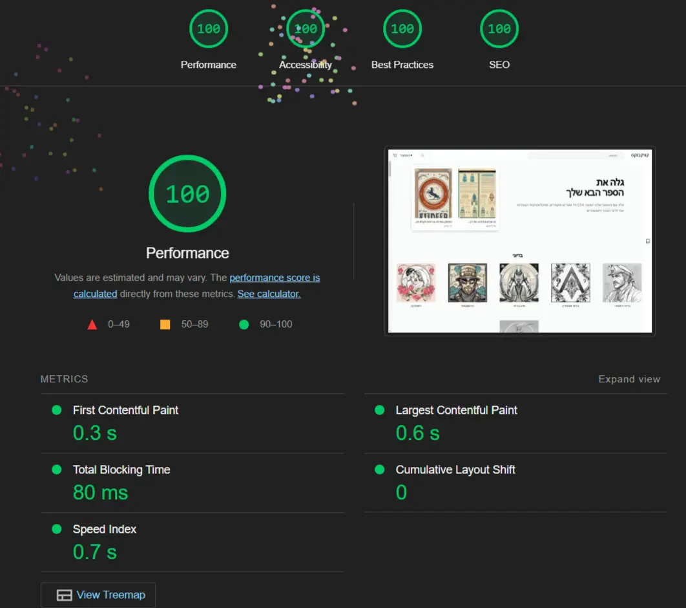

# AI-Generated Bookstore 🚀



Welcome to **AI-Generated Bookstore**, a blazing-fast web application built with **Next.js**. This project was developed to push the limits of performance optimization and provide a seamless user experience. Here's a breakdown of what makes this project special:

## 🎯 Project Overview
- **14,000 AI-generated books**: Each book has a unique title, description, and cover image created using advanced **batch processing** with **OpenAI**.
- **Custom book covers**: Generated using **Stable Diffusion X** and served directly from **blob storage**.
- Designed for speed, usability, and top-tier **Lighthouse** scores.

---

## 📊 Lighthouse Performance
- Achieved perfect scores across all metrics:
  - **Performance**: 100
  - **Accessibility**: 100
  - **Best Practices**: 100
  - **SEO**: 100

---
## ⚡ Key Technologies and Optimizations

### **1. Partial Prerendering**
- Combines **Static Site Generation (SSG)** and **Server-Side Rendering (SSR)** for the best performance.
- Ensures lightning-fast page loads by precomputing and serving static content.

### **2. Smart Prefetching**
- Prefetches data intelligently when hovering over links or categories.
- Data is ready to display the moment it’s needed, minimizing latency.

### **3. Server Actions**
- Improves server communication by reducing redundant API calls.
- Enhances interactivity and responsiveness for a smoother experience.

### **4. Advanced Image Optimization**
- Utilizes **Next.js Image component** for optimized, responsive image loading.
- Implements `loading="eager"` or `"lazy"`, `decoding="sync"`, and `priority` attributes to balance speed and user experience.

---

## 🚀 How the Data Was Generated
- **Batch processing with OpenAI**: Used advanced batching to generate 14,000 unique book titles and descriptions overnight.
- **Stable Diffusion X**: Created book covers, processed, and stored efficiently for fast access.

---

## 🛠️ Setup and Installation

### Installation
1. Install dependencies:
   ```bash
   npm install
   ```
2. Push the database schema:
   ```bash
   npm run db:push
   ```
3. Run the scripts to generate data

4. Run the development server:
   ```bash
   npm run dev
   ```
    

## 💭 Feedback
- Have thoughts about Next.js or this project? Drop your feedback or suggestions in the issues.